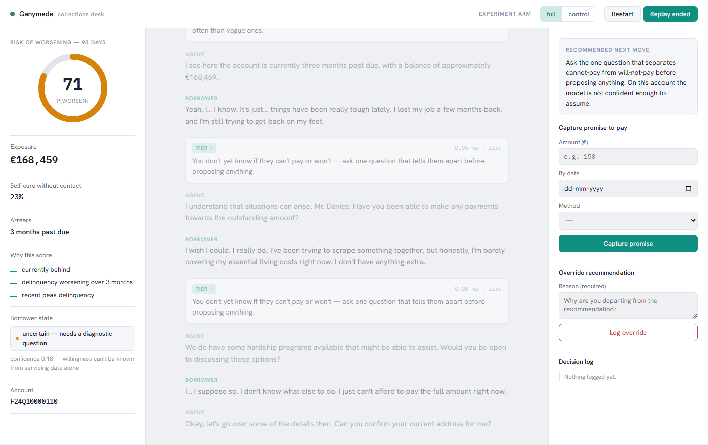
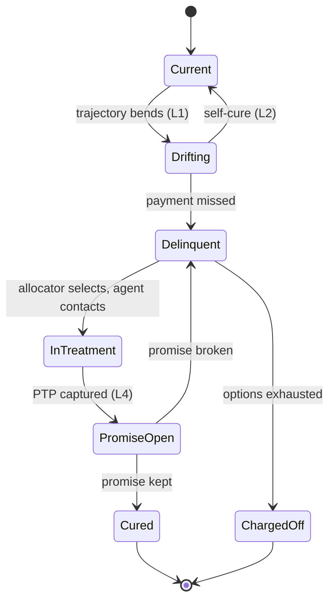
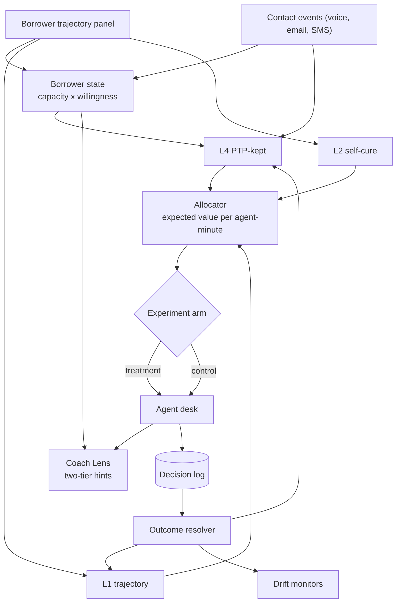
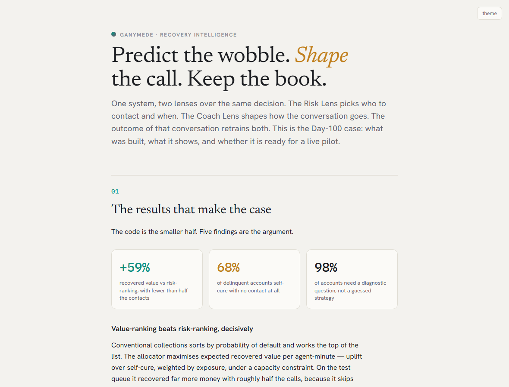

<div align="center">

# 🌘 Ganymede

### Recovery Intelligence for lending, receivables, and investor-funded credit books

**Predict the wobble. Shape the call. Keep the book.**

[](LICENSE)


</div>



---

## What it is

One system, two lenses over the **same decision**.

- **Risk Lens** — who to contact, when, and what to offer. It answers *where does an agent-minute earn the most*.
- **Coach Lens** — what to say once the conversation starts. It answers *how does this call end in money*.

They are one product because they close a single loop: Risk picks the conversation, Coach shapes it, and the outcome of that conversation is the label that retrains both. Split them and each half degrades — a queue nobody knows how to work, or advice with no idea who it is talking to.

**Two live, interactive demos** (private artifacts):
[**▶ Agent Desk**](https://claude.ai/code/artifact/2c0d2222-b533-49a7-a21e-96c7de57b7b9) ·
[**📄 The Case**](https://claude.ai/code/artifact/b09bed53-9373-4c80-938e-7ad50b733cdf)

---

## The results that make the case

Everything below is real pipeline output — backtested, simulated, or measured. No invented numbers.

### Value-ranking beats risk-ranking, decisively

Conventional collections sorts by probability of default and works the top of the list. The allocator maximises **expected recovered value per agent-minute** — uplift over self-cure, weighted by exposure, under a capacity constraint. Fewer calls, more money.


### The risk score is calibrated — the number means what it says

L1 predicts whether an account worsens over the next 90 days. A collections agent reads that number, so calibration is the gate, not AUC.


### The two-tier hint design is forced by physics

Measured from **328 real inter-turn gaps** in a 10-minute call: the median gap is 479 ms, but LLM composition takes 500–1500 ms. So deterministic hints render in under a millisecond and hit the live gap; LLM strategy hints are demoted to the next pause.


### Models drift — and the monitor exists to catch it

Self-cure rate rose sharply across the backtest window. The ranking held; absolute calibration lagged, because no model calibrates to a regime shift it never saw. That is exactly what the outcome loop and drift monitor are for.


---

## Architecture

**Where Ganymede acts.** Conventional collections enters at `Delinquent`. Ganymede enters one state earlier — and `Drifting → Current` with no contact is the transition most systems never notice they are being paid for.



**System flow.** Servicing panel and contact events feed the models; the allocator turns scores into an assignment; the desk surfaces hints; every decision is logged and resolved back into training.



---

## Design invariants

Fourteen failures found in review were converted from a postmortem list into **invariants enforced in code** — a defect is closed when something automated fails if it comes back, never before. A few:

| # | Invariant | Enforced by |
|---|---|---|
| I1 | Synthetic data never supports a predictive-lift claim | `evals/metrics.py` refuses lift on synthetic records |
| I2/I3 | Every decision carries an experiment arm and a propensity | non-optional in `schema.py`; retrain aborts if missing |
| I9 | Accounts ranked by expected value, never by probability | `allocator.py` is the only queue producer |
| I10 | "Do not contact" is a first-class scored action | in the `Action` enum; self-cure precision tracked |
| I13 | No timing feature from a source without calendar dates | `features.py` raises on a source tagged false |

Run them: `python -m ganymede.invariants --check`

---

## Repository structure

```
ganymede/            the Python package
  schema.py          frozen contracts; invariants encoded in the types
  invariants.py      I1-I14 as runnable checks
  panel.py           Freddie Mac -> unified monthly borrower panel
  features.py        trajectory windows + cross-signal features
  risk.py            L1 trajectory + L2 self-cure, calibration, reason codes
  allocator.py       expected-value allocation under capacity
  state.py           capacity x willingness classifier
  generate.py        conversations conditioned on real trajectories
  outcomes.py        promise <-> payment resolver
  llm.py             LLMEngine (OpenRouter), role-based model routing
  audio/             VAD + ASR interface
  coach/             playbook, hint composer, checklist, PTP extractor
  evals/             LLM judge, Krippendorff alpha, metric table
  monitors/          drift (PSI + rate)
app/                 the agent desk and the case (HTML)
docs/                per-phase results, the written case, figures
tests/               invariant + component tests (70 passing)
scripts/             chart generation
```

---

## Quickstart

```bash
pip install -r requirements.txt

# gates — each passes or fails
python -m ganymede.invariants --check
python -m pytest -q
python -m ganymede.panel      --verify        # data pipeline
python -m ganymede.risk       --backtest      # calibration beats base rate
python -m ganymede.allocator  --simulate      # value-ranking beats risk-ranking
```

LLM-dependent paths (generation, coaching, judging) need an `OPENROUTER_API_KEY`
in a local `.env`. The audio and modelling paths run without it.

---

## The case, in one page

<div align="center">

[](https://claude.ai/code/artifact/b09bed53-9373-4c80-938e-7ad50b733cdf)

</div>

**Recommendation: ready for a shadow-then-limited pilot, not a full rollout.** The full write-up — results, pilot stages, and an honest list of what is still missing — is in [`docs/CASE.md`](docs/CASE.md).

Three things this project refused to fake: it does not claim conversation features beat tabular features (that needs real data; the code refuses to compute the number on synthetic records); it does not report recovery or override metrics (those need a pilot, marked pending); it does not dress a regime-shift calibration miss as a pass.

---

## Data and attribution

Code is **MIT** (see [LICENSE](LICENSE)). Data is **not redistributed** here — the
repository references public datasets under their own terms:

- **Freddie Mac Single-Family Loan-Level** — the trajectory backbone (real dates, real delinquency transitions), used under Freddie Mac's data terms.
- **Home Credit Default Risk** — feature enrichment, under the dataset's Kaggle terms.

Ganymede is a research prototype. It is **not fit for production lending decisions** without a pilot and appropriate data-protection controls. Project Jupiter (auxmoney) was inspiration, not specification.

---

<div align="center">

**Nikhilvarma Kandula**

[LinkedIn](https://www.linkedin.com/in/nikhilvarmakandula) ·
[Email](mailto:kandulanikhilvarma@gmail.com) ·
[Portfolio](https://kandula.studio)

</div>
