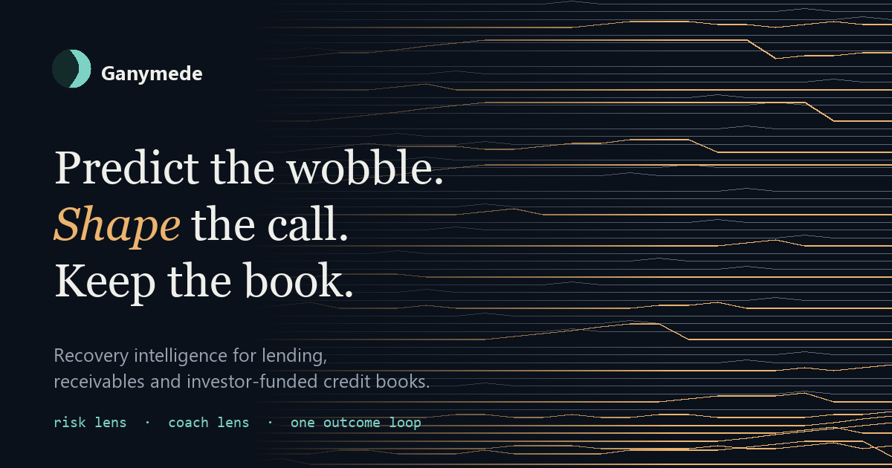
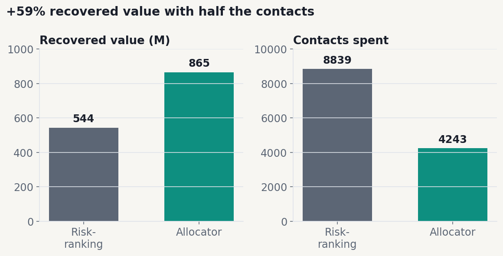
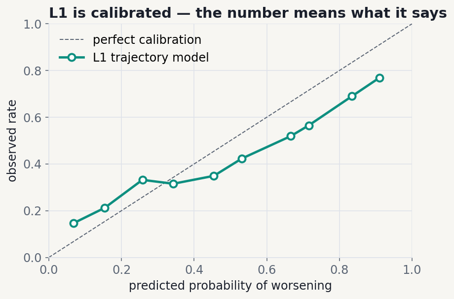
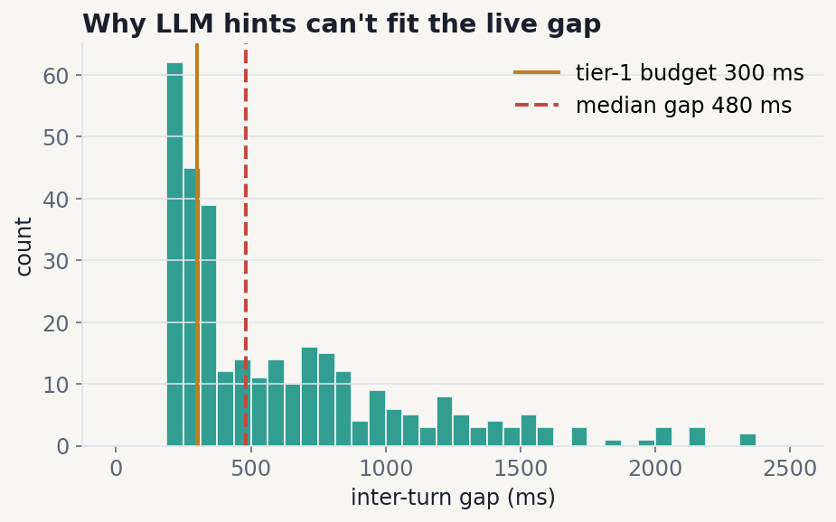
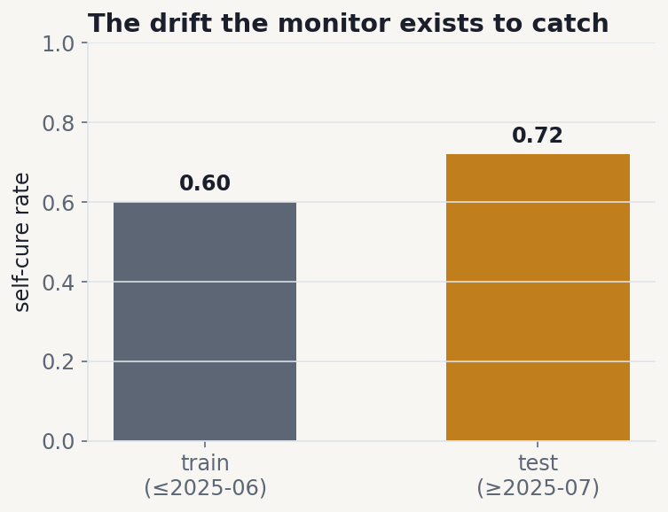
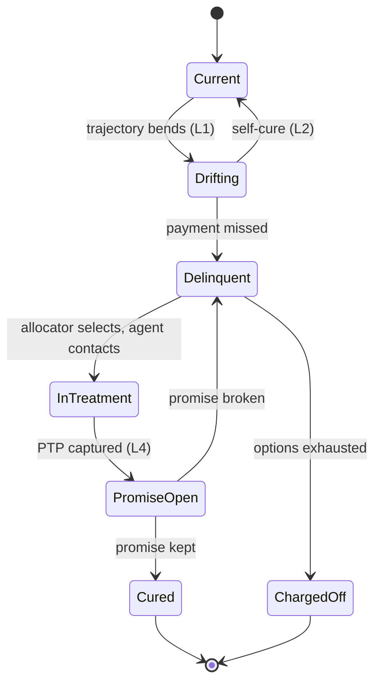
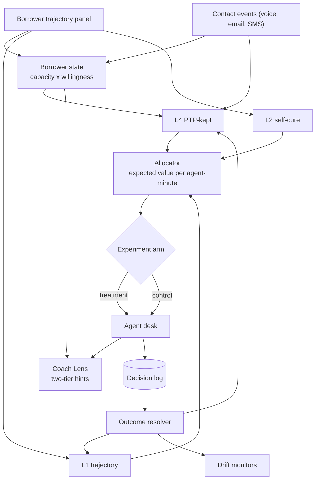

<div align="center">

# 🌘 Ganymede

### Recovery Intelligence for lending, receivables, and investor-funded credit books

**Predict the wobble. Shape the call. Keep the book.**

### [→ ganymede-kandula.vercel.app](https://ganymede-kandula.vercel.app)

[](LICENSE)




</div>

---

## What it is

One system, two lenses over the **same decision**.

- **Risk Lens.** Who to contact, when, and what to offer. It answers *where does an agent-minute earn the most*.
- **Coach Lens.** What to say once the conversation starts. It answers *how does this call end in money*.

They are one product because they close a single loop. Risk picks the conversation, Coach shapes it, and the outcome of that conversation is the label that retrains both. Split them and each half degrades into something worse: a queue nobody knows how to work, or advice with no idea who it is talking to.

---

## The site

Everything below is explorable rather than only readable.

| | |
|---|---|
| [**Start here**](https://ganymede-kandula.vercel.app/) | The argument, and one borrower walked end to end |
| [**How it works**](https://ganymede-kandula.vercel.app/system) | Architecture, data lineage, and all fourteen invariants |
| [**Evidence**](https://ganymede-kandula.vercel.app/evidence) | Every chart with its method, and a drag-the-budget latency histogram |
| [**Allocator studio**](https://ganymede-kandula.vercel.app/queue) | Move the capacity slider; both queues re-rank on real runs |
| [**Agent desk**](https://ganymede-kandula.vercel.app/desk) | Work a real scored queue: hints, promise capture, override, control arm |
| [**The argument**](https://ganymede-kandula.vercel.app/case) | Why it recovers more per agent-minute, and how it reaches the floor |
| [**Glossary**](https://ganymede-kandula.vercel.app/glossary) | Arrears, self-cure, PTP, roll curve, uplift, defined where they are used |
| [**About**](https://ganymede-kandula.vercel.app/about) | Who built it, and why it is called Ganymede |

**No number on that site is typed by hand.** `scripts/build_site_data.py` regenerates `site/data/*.json` by calling the pipeline directly, and every value ships with the kind of evidence behind it: `measured`, `backtested`, `simulated`, `seeded`, or `pending`. A figure with no provenance cannot render at all, and CI fails if the committed JSON drifts from what the code now produces.

---

## The results that make the case

Backtested, simulated, or measured. No invented numbers.

### Value-ranking beats risk-ranking, and most where it matters

The allocator maximises **expected recovered value per agent-minute**: uplift over self-cure, weighted by exposure, under a capacity constraint. At 15% of full-coverage capacity it recovers **+59%** more than risk-ranking using roughly half the contacts. At 2% capacity the edge is **+193%**. At 60% it converges to **+2.4%**, because with enough agents to call everybody the ordering stops mattering.



Two real rows carry the argument on their own. A €1.93M account at 18% probability that risk-ranking never reaches anywhere in the sweep, and a €1,289 account at 83% that it funds at 5% capacity while the allocator never does. [Move the slider yourself.](https://ganymede-kandula.vercel.app/queue)

### The risk score is calibrated, so the number means what it says

L1 predicts whether an account worsens over the next 90 days. A collections agent reads that number and acts on its face value, so calibration is the gate rather than AUC.



### The two-tier hint design is forced by physics

Measured from **328 real inter-turn gaps** in a 10-minute call. The median gap is 479 ms and the enforced budget is 300 ms, which is the p25 of 292 ms rounded up. **75%** of real turn boundaries are wide enough for a hint at that budget, against only **48%** for a 500 ms model call. So deterministic hints render in under a millisecond and land live, while model-composed strategy hints wait for the next pause rather than racing the budget.



### Models drift, and the monitor exists to catch it

Self-cure rate rose from 0.60 to 0.72 across the backtest window. The ranking held. Absolute calibration lagged, because no model calibrates to a regime shift it never saw. That is exactly what the outcome loop and drift monitor are for.



---

## Architecture

**Where Ganymede acts.** Conventional collections enters at `Delinquent`. Ganymede enters one state earlier, and `Drifting → Current` with no contact is the transition most systems never notice they are being paid for.



**System flow.** Servicing panel and contact events feed the models, the allocator turns scores into an assignment, the desk surfaces hints, and every decision is logged and resolved back into training.



---

## Design invariants

Fourteen failures found in review were converted from a postmortem list into **invariants enforced in code**. A defect is closed when something automated fails if it comes back, never before. A few:

| # | Invariant | Enforced by |
|---|---|---|
| I1 | Synthetic data never supports a predictive-lift claim | `evals/metrics.py` refuses lift on synthetic records |
| I2/I3 | Every decision carries an experiment arm and a propensity | non-optional in `schema.py`, retrain aborts if missing |
| I9 | Accounts ranked by expected value, never by probability | `allocator.py` is the only queue producer |
| I10 | "Do not contact" is a first-class scored action | in the `Action` enum, self-cure precision tracked |
| I13 | No timing feature from a source without calendar dates | `features.py` raises on a source tagged false |

[All fourteen, with what each one caught →](https://ganymede-kandula.vercel.app/system)

---

## The interface is generated too

The same discipline runs through the front end, because a design system and a headline figure are both places a known defect can quietly return.

- **Colour is semantic, not decorative.** Ice is the system's own signal, ember carries the magnitude of a *prediction*, and green and red are spent only on realised outcomes. A probability never gets three colours, because that invents category boundaries the model never produced.
- **The ramps are generated in OKLCH** by `scripts/gen_palette.py`, which fails the build if any of fourteen named contrast pairs drops below its floor, or if the risk ramp stops darkening monotonically and therefore stops encoding magnitude.
- **The artwork is drawn from the data.** The hero backdrop is real borrower trajectories out of the panel. The moon is procedural, seeded, and coloured from tokens. There are no stock images and the site makes no third-party request at all.
- **Three typefaces, vendored.** Fraunces for the argument, Geist and Geist Mono for the readout, self-hosted by `scripts/fetch_fonts.py`, which also writes the preload tags so they cannot go stale when a family changes.

---

## Repository structure

```
ganymede/            the Python package
  schema.py          frozen contracts; invariants encoded in the types
  invariants.py      I1-I14 as runnable checks
  panel.py           Freddie Mac -> unified monthly borrower panel
  features.py        trajectory windows + cross-signal features
  risk.py            L1 trajectory + L2 self-cure, calibration, reason codes
  allocator.py       expected-value allocation, capacity sweep, frontier
  state.py           capacity x willingness classifier
  generate.py        conversations conditioned on real trajectories
  outcomes.py        promise <-> payment resolver
  llm.py             LLMEngine (OpenRouter), role-based model routing
  audio/             VAD + ASR interface
  coach/             playbook, hint composer, checklist, PTP extractor
  evals/             LLM judge, Krippendorff alpha, metric table
  monitors/          drift (PSI + rate)
site/                the deployed site: no framework, no bundler, no build step
  *.html             nine pages and a 404
  assets/            generated tokens, shared CSS, vendored fonts, the mark
  assets/js/         charts, provenance-resolved figures, procedural artwork
  data/              generated from the pipeline, never hand-edited
scripts/
  build_site_data.py pipeline -> site/data/*.json, with provenance
  gen_palette.py     OKLCH ramps -> tokens.css, with contrast gates
  fetch_fonts.py     vendors the typefaces and rewrites the preload tags
  make_og.py         the social card, drawn from real trajectories
  make_charts.py     the README figures
docs/                per-phase results, the written case, figures
tests/               invariant + component tests (70 passing)
```

---

## Quickstart

```bash
pip install -r requirements.txt
```

Five gates, each passes or fails:

```bash
python -m ganymede.invariants     --check     # I1-I14
python -m pytest -q                           # 70 tests
python scripts/gen_palette.py     --check     # contrast pairs + ramp monotonicity
python scripts/fetch_fonts.py     --check     # vendored faces + preload freshness
python scripts/build_site_data.py --check     # site figures against the pipeline
```

And the pipeline itself, which needs the source data present:

```bash
python -m ganymede.panel     --verify    # data pipeline
python -m ganymede.risk      --backtest  # calibration beats base rate
python -m ganymede.allocator --simulate  # value-ranking beats risk-ranking
```

Serve the site locally with `python -m http.server 4173 --directory site`.

LLM-dependent paths (generation, coaching, judging) need an `OPENROUTER_API_KEY` in a local `.env`. The audio, modelling, and site paths run without it.

---

## The argument, in short

**Shadow first, then a randomised slice, then the floor.** Everything needed before the system touches a real borrower already exists: a calibrated risk model with reason codes, an allocator that beats the status quo, a coaching layer inside the latency budget, an experiment framework that can prove or disprove value, and a decision log of every score, hint and override. The full write-up is at [`/case`](https://ganymede-kandula.vercel.app/case) and in [`docs/CASE.md`](docs/CASE.md).

Three things this project refuses to fake, all of which would have been easy. It does not claim conversation features beat tabular features, because the code will not compute that number on synthetic records. It does not report recovery lift, promise-kept lift or override rate, because those need live data and carry a pending badge rather than an estimate. It does not dress a regime-shift calibration miss as a pass, and it does not bury it either.

---

## Data and attribution

Code is **MIT** (see [LICENSE](LICENSE)). Data is **not redistributed** here. The repository references public datasets under their own terms:

- **Freddie Mac Single-Family Loan-Level**, the trajectory backbone with real dates and real delinquency transitions, used under Freddie Mac's data terms.
- **Home Credit Default Risk**, feature enrichment, under the dataset's Kaggle terms.

Model outputs are advisory, and every decision is logged with its experiment arm and propensity, which is what makes the system auditable after the fact.

---

<div align="center">

**Nikhilvarma Kandula**

[LinkedIn](https://www.linkedin.com/in/nikhilvarmakandula) ·
[Email](mailto:kandulanikhilvarma@gmail.com) ·
[kandula.studio](https://kandula.studio)

</div>
