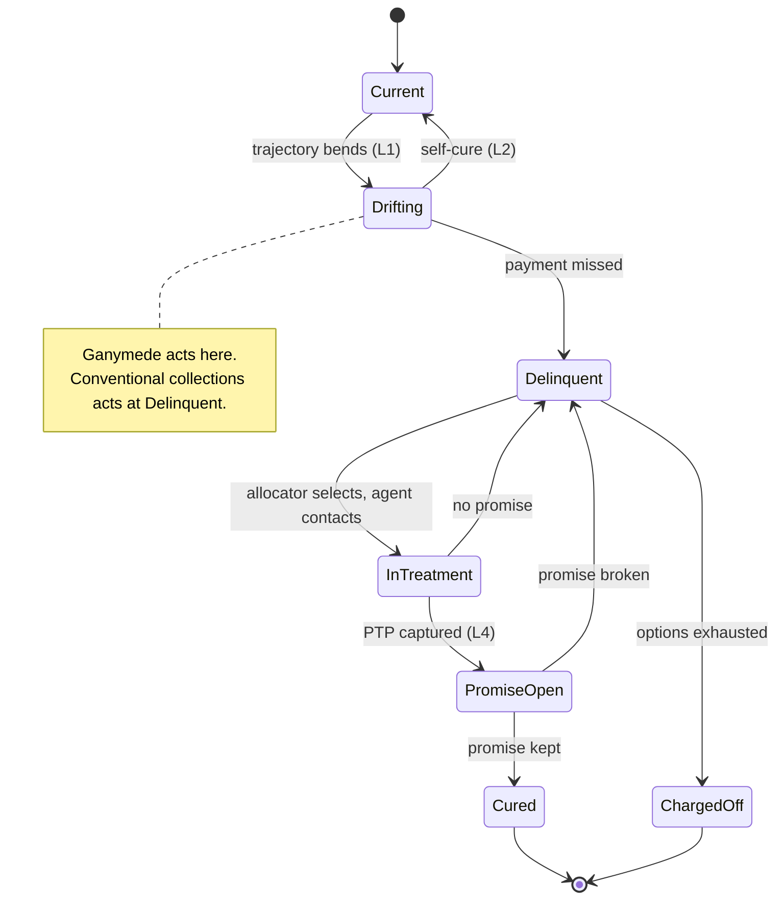
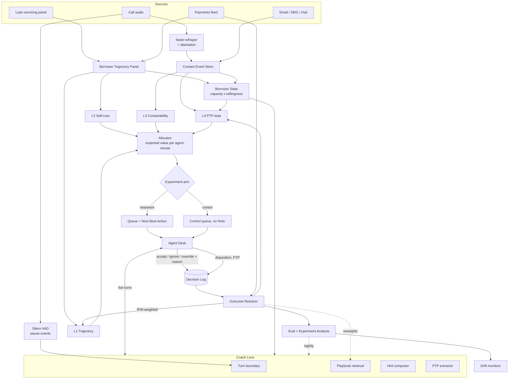
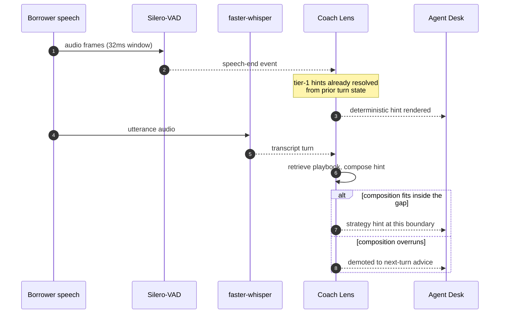
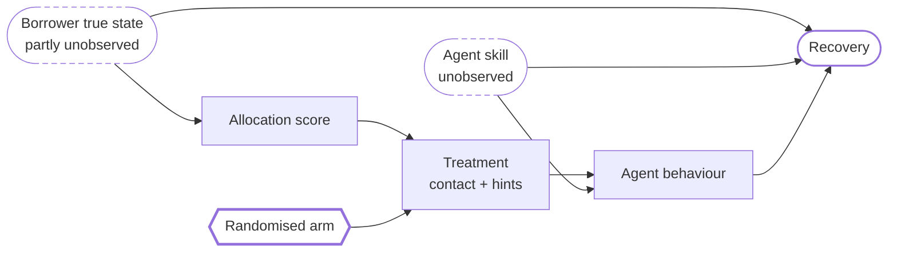

# Ganymede — Recovery Intelligence System

**v3.** Regulatory framing removed — Project Jupiter is inspiration, not specification. This is a general product for lending, receivables, and investor-funded credit books.

Changes in this revision: defects converted from a postmortem list into enforced invariants; architecture split into four purpose-built diagrams, each validated through the Mermaid render connector; a design system added with explicit bans; phases made strictly sequential with pass/fail gates; open risks paired with researched methods and sources rather than acknowledgements.

---

## Context

**The business problem.** Money goes out. Some of it does not come back. The gap between "borrower starts to wobble" and "someone has a useful conversation with them" is where the loss lives. Three failures stack:

1. **Wrong time.** Contact happens after a payment already failed, when options have narrowed and the borrower is already defensive.
2. **Wrong people.** Queues are ranked by how bad the account looks, not by how much money a conversation could actually recover. Effort goes to accounts that were going to pay anyway, and to accounts nothing will save.
3. **Wrong conversation.** Whatever approach that particular agent happens to favour, with no memory of what has worked on borrowers like this one. Good agents carry the knowledge in their heads and it leaves when they do.

**What Ganymede is.** One system, two lenses over the same decision.

- **Risk Lens** — who to contact, when, on what channel, and what to offer. It answers *where does an agent-minute earn the most*.
- **Coach Lens** — what to say once the conversation starts, and what to fix afterwards. It answers *how does this conversation end in money*.

They are one product because they close a single loop: Risk picks the conversation, Coach shapes it, the outcome of that conversation is the label that retrains both. Split them and each half degrades — a queue nobody knows how to work, or advice with no idea who it is talking to.

**Name.** Ganymede. Largest of Jupiter's moons, and in myth the cup-bearer — the one who serves. Keeps the Jovian lineage as a nod to the inspiration without being about it.

**Success.** More money recovered per agent-hour, with borrowers who stay borrowers. Both halves matter: a system that maximises this quarter's collections by burning relationships is a machine for destroying next year's book.

---

## Design invariants

Fourteen failures were found in the first pass. Writing them down as a list of past mistakes would guarantee repeating them — that list gets read once and never again. Each is restated as an **invariant with an enforcement mechanism**, so the constraint lives in the codebase rather than in a document nobody reopens.

**The standing rule:** a defect is not closed when it is fixed. It is closed when an invariant is written and something automated fails if that invariant breaks. Every defect found from here joins the same table, with the same requirement.

| # | Invariant | Enforced by |
|---|---|---|
| **I1** | Synthetic conversations never support a predictive-lift claim. They validate plumbing, latency, hint format, and UI | `Conversation.is_synthetic` flag; `evals/metrics.py` refuses to compute lift on a set containing synthetic records |
| **I2** | Every conversation carries an experiment arm assigned before it starts | `schema.py` makes `arm` non-nullable; `test_experiment.py` asserts no decision writes without one |
| **I3** | Every decision logs the acting policy and its propensity | Non-nullable `propensity` on the decision row; retrain script aborts if any row in the window is missing it |
| **I4** | The latency budget is a measured number, never a chosen one | Budget lives in `config.py`, sourced from the Phase 0 gap distribution; CI fails if p95 exceeds it |
| **I5** | A strategy is never promoted by outcome data below minimum support, and every strategy hint shows its support count | `playbook.py` min-support gate; hint renderer requires a support field |
| **I6** | No component inside the label path ships without its own gold set and accuracy bar | Phase 6 gate; `extract.py` blocked from use until its bar is cleared |
| **I7** | Strategy selection branches on borrower state, never on risk score alone | `compose.py` requires a `BorrowerState`; uncertain state yields a diagnostic question, not a strategy |
| **I8** | `ContactEvent` is channel-agnostic. Nothing in Coach Lens assumes voice | Schema-level; async compose mode uses the same playbook path |
| **I9** | Accounts are ranked by expected value, never by probability | `allocator.py` is the only queue producer. No sort-by-score path exists |
| **I10** | "Do not contact" is a first-class action with money attached | Allocator output enum includes it; self-cure precision is a tracked metric |
| **I11** | Conversation outcome outranks hint usefulness. Hints per conversation are capped | `compose.py` rate limiter; `metrics.py` reports outcome first |
| **I12** | Input, score, and outcome distributions are monitored | `monitors/drift.py` runs nightly, non-zero exit on breach |
| **I13** | No timing, seasonality, or contact-hour feature is derived from a dataset without calendar dates | `panel.py` tags each source with `has_calendar_dates`; `features.py` raises if a timing feature reads a source tagged false |
| **I14** | The riskiest open assumption is tested in the current phase, not a later one | Phase order is reviewed at each gate; a phase cannot be entered while an earlier phase's assumption is untested |

The original defect analysis — what was wrong, why it mattered, how it was caught — is kept in `docs/defects.md` rather than here, so this section stays a list of live constraints instead of growing into a changelog.

---

## The objective function

Everything the Risk Lens does reduces to one allocation problem. Given a portfolio of accounts and a fixed pool of agent-minutes, choose an action per account:

```
maximise   Σ  [ ΔP(recover | action) × exposure  −  cost(action)  −  λ · P(harm | action) ]
           a

where  ΔP(recover | action) = P(recover | action) − P(self-cure | no action)
       cost(action)         = agent-minutes × loaded rate  +  channel cost
       P(harm)              = probability of complaint, churn, or relationship damage
       λ                    = how much future book you refuse to trade for this quarter
subject to Σ agent-minutes ≤ capacity
```

Four things fall out of this that a plain risk score cannot express:

- **Δ, not P.** The value of contacting someone is the *uplift* over leaving them alone. Self-cure subtracts. This is the I10 fix expressed mathematically.
- **Exposure weighting** kills the I9 failure directly.
- **λ** is the dial between short-term recovery and long-term book health. Set it to zero and the system optimises into harassment, wins this quarter, and loses the portfolio. Making it an explicit parameter forces the business to state its answer instead of discovering it in a churn report.
- **Capacity constraint** turns scoring into *assignment*. Ranking is the degenerate case where capacity is the only thing binding.

This objective is the spine. Every model below exists because this equation needs one of its terms.

---

## Borrower state model

The psychological layer. Two axes, four quadrants, four completely different correct behaviours.

```
                    WILL NOT PAY  ←──────────────→  WILL PAY

  CANNOT PAY   │  Distressed avoider      │  Willing but broke        │
               │  Broke and hiding        │  Broke and honest         │
               │  → re-establish contact  │  → affordability first,   │
               │    safety, then hardship │    realistic small plan,  │
               │    assessment            │    do not over-promise    │
               ├──────────────────────────┼───────────────────────────┤
  CAN PAY      │  Strategic defaulter     │  Disorganised payer       │
               │  Has money, not paying   │  Has money, forgot/friction│
               │  → consequences, firm,   │  → remove friction,       │
               │    escalation path       │    autopay, one nudge     │
```

**Why this drives everything.** The same hint is right in one quadrant and actively harmful in another. "Ask for a firm commitment today" works on the disorganised payer and the strategic defaulter. Aimed at someone who genuinely has nothing, it produces a promise that cannot be kept — which is worse than no promise, because a broken promise poisons the next three conversations and corrupts the training label.

**Estimated from:** payment trajectory shape (gradual decay vs. sudden stop), channel responsiveness, prior promise-keeping, stated reason codes, conversation content in live mode. Trajectory shape alone is informative — sudden stop after clean history reads as shock or dispute; slow decay reads as capacity erosion.

**Uncertainty is an output.** When the quadrant is unclear, Coach Lens does not guess a strategy — it surfaces the **diagnostic question** that would resolve it. Teaching an agent what to *ask* is more valuable than telling them what to say, and it is the honest move when the model does not know.

---

## Architecture

Four diagrams, each answering a question the others cannot. All validated through the Mermaid render connector before being committed here.

### 1. Where Ganymede acts

The thesis in one picture. Conventional collections enters at `Delinquent`. Ganymede enters one state earlier, and `Drifting → Current` without any contact is the state transition most systems never notice they are being paid for.



### 2. System flow



### 3. The latency budget

The two-tier delivery in I4, drawn against real time. Deterministic hints resolve from the *previous* turn's state, so they are already rendered when the gap opens. LLM composition races the gap and loses gracefully — a hint that overruns is demoted rather than dropped on top of the agent mid-sentence.



### 4. Why the experiment arm exists

The measurement problem as a causal graph, which a flowchart cannot express. Dashed nodes are unobserved.

Without the randomised arm, there is an open backdoor path `Treatment ← Allocation ← Borrower state → Recovery`. Any measured association between hints and recovery is then partly the allocator selecting recoverable borrowers, and there is no way to separate the two after the fact. Randomising the arm severs `Treatment`'s dependence on borrower state and closes the path. Agent skill opens a second backdoor through behaviour, which is why the design randomises by agent-week rather than by agent.



### Component contracts

| Component | In | Out | Notes |
|---|---|---|---|
| **Trajectory Panel** | servicing + payments | monthly borrower panel, real dates | Freddie Mac schema as canonical shape |
| **Borrower State** | panel + contact history | capacity, willingness, confidence | Drives every strategy branch |
| **L1 Trajectory** | panel windows | P(delinquency transition) 30/60/90d | LightGBM, calibrated |
| **L2 Self-cure** | panel windows | P(pays with no contact) | The subtraction term |
| **L3 Contactability** | contact history | best hour × channel, P(reach) | Needs real dates — hence I13 |
| **L4 PTP-kept** | state + conversation | P(promise holds) | The money model |
| **Allocator** | all models + capacity | ranked assignment, or "do not contact" | Solves the objective, not a sort |
| **Turn Boundary** | raw audio frames (VAD) | pause events, ~30 ms | Gates hint rendering. Runs independently of ASR |
| **ASR** | audio | transcript turns, diarised | `faster-whisper` behind an `ASREngine` interface |
| **Playbook** | strategy corpus | ranked strategies + support count | Min-support gate |
| **Hint Composer** | state + playbook + context | ≤1 hint, with its evidence | Rate-limited |
| **PTP Extractor** | transcript | promise: date, amount, method, confidence | Own gold set (I6) |
| **Outcome Resolver** | promises + payments | kept / broken / partial / none | Closes the loop |
| **Experiment** | conversation id | arm assignment | Permanent control arm |

**Single agent, not a crew.** Coach Lens is one model call per hint over retrieved context. A multi-agent debate while a human is mid-sentence is the wrong shape at any latency. Multi-agent stays offline — generation, judging, error analysis — where latency is free and parallelism pays.

---

## Coach Lens — feature set

Ordered by value per unit of build effort.

1. **Promise-quality coach.** Vague promise → prompt for date, amount, and method. "I'll try next week" and "€150 on the 3rd by direct debit" have very different kept-rates. Cheap to build, directly moves the money metric. **Highest ROI feature in the system.**
2. **Diagnostic question prompter.** When borrower state is uncertain, surface the question that resolves it rather than a strategy that assumes.
3. **Objection handler.** Classify the objection, surface what worked on this objection for similar borrowers, with support count.
4. **Missed-commitment recall.** "Two prior promises broken; both were verbal with no date." Context an agent cannot hold across a queue.
5. **Affordability walkthrough.** Structured income/expense prompts, live plan computation, so the agreed plan is one the borrower can actually service.
6. **Next-best-offer.** Which restructure, plan, or settlement to offer given segment and expected recovery. Bounded by what the agent is authorised to give.
7. **Live checklist.** Identity confirmed, amount stated, plan confirmed, next step agreed. Deterministic, no model.
8. **Talk-ratio and question-rate nudge.** Behavioural and observable: agent has held the floor for 90 seconds, or has asked no open question. Not affect modelling — countable events.
9. **Escalation detector.** Reads borrower language for dispute, hardship disclosure, or vulnerability signals that should change the path or hand off.
10. **Post-call summary, disposition, and CRM write-back.** Saves real minutes per call. The single biggest driver of voluntary adoption — agents use the tool that does their admin.
11. **Async compose mode.** Same playbook, applied to email and message drafting.
12. **Weekly coaching digest.** Per-agent, behaviour-based, with clips from their own calls and their own outcome numbers.
13. **Practice simulator.** LLM roleplays borrower personas drawn from real segments. Reuses the generation stack for free, and is the safest place to test aggressive strategies.

---

## Risk Lens — feature set

1. **Pre-delinquency early warning.** Still current, trajectory bending. The whole point — reach people before the miss.
2. **Self-cure suppression.** Do-not-contact as a recommendation with money attached to it.
3. **Expected-value allocation** under capacity constraint.
4. **Right-time / right-channel.** Per-borrower contact timing from response history.
5. **Cure-path recommender.** Reminder / plan / restructure / settle / escalate, with expected recovery per path.
6. **Reason codes.** Every score arrives with its top drivers in plain language. Agents do not trust a bare number, and they are right not to.
7. **Roll-rate forecasting.** Portfolio-level bucket transitions for staffing and provisioning.
8. **Investor / fund view.** Expected recovery curves and vintage cohort performance — relevant where the book is externally funded.
9. **Drift and segment monitors.**
10. **Capacity simulator.** "What does 20% fewer agent-hours cost in recovery?" Turns the allocator into a planning tool.

---

## Data plan

| Asset | Source | Volume | Role | Honest limit |
|---|---|---|---|---|
| **L1 backbone** | Freddie Mac SF Loan-Level | 300k loans × up to 60 monthly rows, sampled from 1999–2025 | Real dates, real delinquency transitions, real cure/roll behaviour | Mortgages, not consumer credit — trajectory *shapes* transfer, absolute rates do not |
| Feature richness | Home Credit | 30k borrowers | Bureau + prior-application features not in Freddie | **No calendar dates** (I13) — never used for timing |
| Sanity set | UCI German Credit | 1,000 | Fast tests, well-understood | Toy scale |
| Conversations | Generated, conditioned on trajectories | 1,200 (900 dev / 300 held-out) | Plumbing, latency, hint format, UI | **Cannot prove lift** (I1) |
| Hint gold set | Hand-labelled, solo | 150 conversations ≈ 900 hint judgments | Judge calibration, hint usefulness | **Single labeller** — see protocol below |
| PTP gold set | Hand-labelled, solo | 300 promise spans | Extractor accuracy bar (I6) | Must clear before use |
| Realism check | Licensed contact-centre corpus | ~30 h | Does synthetic resemble real ASR output | Paid, optional |

**Why 300k loans.** Freddie Mac full is ~55M loans and will not fit on a laptop. 300k stratified on origination vintage and delinquency outcome gives enough transitions for per-segment calibration while staying in memory with polars. Vintage stratification matters — a model trained only on 2008–2010 learns a crisis, not a business.

**Why 1,200 conversations.** Where judge-agreement estimates stabilise. 150 gold is the ceiling one person labels carefully before quality decays; ~6 hint opportunities each yields ~900 judgments, enough for a usable confidence interval on hint usefulness.

**Generation design.** Seed each conversation from a real trajectory row plus a borrower-state quadrant plus a hardship taxonomy entry. The generator does not see the outcome label. This bounds but does **not** eliminate I1 — the seed still correlates with the outcome, so synthetic data remains unusable for lift claims. Stated in the code and in the write-up.

**ASR noise injection.** Deliberately corrupt a slice of the dev set with realistic transcription errors, disfluencies, and crosstalk. Hints that only survive clean text will not survive production.

### Solo labelling protocol

One labeller is the ceiling on every evaluation in this project, so the protocol has to carry weight the second labeller would otherwise carry.

- **Rubric before labels.** Write the usefulness rubric with concrete positive and negative examples, freeze it, and version it. Changing the rubric mid-set silently invalidates everything labelled before the change.
- **Randomised order.** Label in shuffled order, never grouped by segment or by model version. Grouped labelling drifts — the tenth hint of a run gets judged against the ninth, not against the rubric.
- **Blind on source.** Hints from different prompt versions are indistinguishable at label time. Otherwise the labeller grades the version they hope is winning.
- **Self-agreement measurement.** Re-label a random 20% after a two-week gap, blind. That intra-rater agreement number replaces human–human agreement as the ceiling on judge quality. Without it, "judge agrees with human 84%" is uninterpretable — it could be above the labeller's own consistency, which would mean the judge is fitting noise.
- **Batch discipline.** No more than 50 judgments per sitting. Label quality decays with fatigue and the decay is invisible from inside.
- **Adjudication log.** Every hard call gets one line recording why. It becomes the rubric's next revision, and it is the artifact that makes solo labelling defensible to someone reading the write-up.

---

## Experiment design

Built in from the first line of the desk, not retrofitted.

- **Arms:** `full` (risk + coaching), `risk_only` (queue but no hints), `control` (neither). Assigned at conversation level, sticky per borrower to avoid contaminating a relationship across calls.
- **Randomisation unit:** borrower, not conversation, when measuring recovery — spillover across a borrower's calls otherwise leaks treatment into control.
- **Switchback by agent-week** for coaching effects, since agents learn from hints and stay taught. A between-agent design confounds hint effect with agent skill; a within-agent design confounds it with learning. Switchback with washout is the least-wrong option and its limitations get stated.
- **Permanent control** at low allocation, forever. It is how you notice the model rotting.
- **Propensity logging** on every decision, feeding IPW at retrain (I3).
- **Guardrail metrics** that stop a rollout regardless of recovery lift: complaint rate, broken-promise rate, repeat-contact rate.

Without this section the product has opinions. With it, the product has evidence.

---

## Repository layout

```
ganymede/
  pyproject.toml
  README.md
  ganymede/
    config.py          # paths, model ids, thresholds, lambda, measured latency budget
    schema.py          # Pydantic: Borrower, Panel, ContactEvent, Hint, Score,
                       #   Decision, Promise, Outcome, Arm
    invariants.py      # I1-I14 as runnable checks
    panel.py           # Freddie Mac + Home Credit -> unified monthly panel
    features.py        # trajectory windows, cross-signal combinations
    state.py           # capacity x willingness classifier
    models/
      trajectory.py    # L1
      selfcure.py      # L2
      contactability.py# L3
      ptp.py           # L4
      calibrate.py     # isotonic + reliability, shared
      explain.py       # SHAP -> reason codes, shared
    allocator.py       # objective function under capacity
    experiment.py      # arm assignment, propensity logging
    generate.py        # conditioned synthetic conversations + ASR noise
    audio/
      asr.py           # ASREngine interface + faster-whisper impl
      vad.py           # silero-vad -> pause events
    coach/
      boundary.py      # pause events -> hint-eligible turn boundaries
      playbook.py      # retrieval, min-support gating
      compose.py       # hint composition, rate limiting
      extract.py       # PTP extraction
      checklist.py     # deterministic checks
    outcomes.py        # promise <-> payment resolver
    evals/
      judge.py         # LLM-as-judge, gold-calibrated
      metrics.py       # the metric table below
      experiment.py    # arm analysis, IPW, guardrails
      suites/          # versioned prompt test suites
    monitors/
      drift.py         # input, score, outcome drift
  app/                 # Next.js agent desk + practice simulator
  notebooks/           # EDA, feature analysis, error analysis
  reports/             # nightly eval + drift output
  docs/
    defects.md         # what broke, why, how it was caught
    status.md          # phase state, gate results
    rubric.md          # frozen labelling rubric, versioned
  tests/
```

**Stack.** Python 3.13, polars, LightGBM, scikit-learn, Pydantic, pytest. `faster-whisper` + `silero-vad` for the audio layer. Claude API for generation, hints, extraction, judging. Next.js on Vercel; Supabase Postgres + pgvector for decision log, playbook index, and feedback. Verified locally: git 2.53, gh 2.96, node 22.22, npm 10.9, python 3.13.

**Token discipline.** Prompt-cache system prompt, playbook, and judge rubric — stable, large, and where the cost actually accumulates. Cheap model for extraction and routing, strong model for judging only. Structured outputs so nothing is re-asked. Batch all offline generation and judging. Read the `claude-api` skill before the first API call for current model IDs, pricing, and cache syntax — do not write model strings or prices from memory.

---

## Design system

Applies to the agent desk and the written case. Written down here because "we'll figure out the styling later" is how a product ends up looking like every other AI demo.

**Typefaces.** Two families, no more.

| Role | Face | Why |
|---|---|---|
| UI text | **Instrument Sans** | Grotesque with actual character. Not Inter, not `system-ui` — both are the default nobody chose |
| Numerics | **IBM Plex Mono**, tabular figures | Money columns must align on the decimal. Proportional figures make a queue unreadable at a glance |
| Case headings | **Instrument Serif** | Written document only. Never on the desk |

Two weights: 400 and 600. A third weight is almost always someone avoiding a hierarchy decision. Type scale 12 / 13 / 15 / 19 / 24 / 32 — a real ratio, not a 4px ladder.

**Colour.**

- **Dark-first.** Agents look at this for eight hours. The light theme is the secondary target, not the design surface.
- **Risk is ordinal, so it gets a sequential single-hue ramp** — light to dark within one hue. Traffic-light red/amber/green is the actual slop here: it invents three categories out of a continuous quantity, and it fails for roughly one in twelve men. Encode magnitude with lightness, which survives both problems.
- **One accent, reserved for the next action.** If four things are accented, nothing is.
- Semantic colour only where the state is genuinely binary — promise kept, promise broken.
- Every text/surface pair verified at ≥4.5:1 by script, not by eye.

**Banned outright**, because they are the visual signature of generated work: purple-to-blue gradient headers, glassmorphism and backdrop-blur panels, uniform `rounded-2xl shadow-lg` card soup where every element carries equal visual weight, emoji used as iconography, centre-aligned body text, the three-column icon-heading-blurb grid, and animated gradient borders.

**Motion.** This is where the desk differs from a normal app, and the reasoning is product reasoning rather than taste.

- Hints do not slide, bounce, or scale in. Peripheral motion during a live call pulls the agent's attention off the borrower — a cost paid directly against the product's own primary metric.
- Opacity-only transitions, ≤120 ms, with the element's position fixed before and after so nothing reflows under the eye.
- Nothing loops. No shimmer skeletons on a screen someone stares at all day.
- `prefers-reduced-motion` honoured.

**Layout.** The desk is deliberately dense. Information density is a feature in an operations tool; the airy marketing layout wastes the screen an agent actually needs. One axis of hierarchy: *what to do now* above *who this is* above *what happened before*.

**Charts.** Built with the `dataviz` skill, sequential palette matching the risk ramp. Risk over time is a line with an uncertainty band, never a gauge — a gauge spends a third of the screen encoding one number and hides the trajectory, which is the only part that matters here.

**Verified by:** a contrast-check script in CI, screenshot diffs between themes, and a reduced-motion pass.

---

## Phases

**Strictly sequential.** No phase begins until the previous phase's exit gate has passed on a clean run. Overlap was removed from this plan deliberately: overlapping phases hide which gate actually failed, and every phase here produces an input the next one depends on. Sequence is also what makes I14 enforceable — the riskiest open assumption belongs to the current phase, and you cannot know that if three phases are half-done at once.

Each phase below states **entry**, **work**, and **exit gate**. The exit gate is a command with a pass/fail result, never a judgement call.

| # | Phase | Weeks | Entry requires | Exit gate (must pass) |
|---|---|---|---|---|
| **0** | Spike | 1 | Nothing | Written finding + measured gap distribution + derived latency budget committed to `config.py` |
| **1** | Foundation | 2 | Phase 0 budget exists | `pytest tests/test_experiment.py` green; CI green; `schema.py` frozen and tagged |
| **2** | Panel | 3–4 | Schema frozen | `python -m ganymede.panel --verify` green; data-quality baseline written |
| **3** | Risk models | 5–6 | Panel verified | `python -m ganymede.models --backtest` — calibration beats base rate on a held-out **time** slice, per segment |
| **4** | Allocator | 7 | L1/L2/L3 calibrated | `python -m ganymede.allocator --simulate` — value-ranking beats risk-ranking on recovery-per-minute |
| **5** | Borrower state | 8 | Allocator passing | `pytest tests/test_state.py` — quadrant agreement against hand-labelled cases; uncertainty fires correctly |
| **6** | Conversations + extraction | 9–10 | State classifier passing | `python -m ganymede.outcomes --verify` — extractor over its accuracy bar (I6); every promise resolves, no silent drops |
| **7** | Coach Lens | 11–12 | Extractor cleared | `pytest tests/test_coach.py` — every hint passes the checklist gate; p95 latency inside the Phase 0 budget; hint rate under ceiling |
| **8** | Evals | 13–14 | Coach Lens passing | `python -m ganymede.evals --report` — full table with confidence intervals; judge agreement at or below intra-rater ceiling |
| **9** | Agent Desk | 15–17 | Eval harness reporting | Deployed URL; replayed conversation streams; hints fire at turn boundaries; override writes a reasoned row; control arm shows no hints |
| **10** | Case + roadmap | 18–19 | Desk deployed | Three documents: results with honest limits, pilot design, what is still missing |

**Per phase:** work is scoped by the exit gate, not by a task list. If the gate cannot be made to pass, the phase is not extended silently — the design changes and the reason lands in `docs/defects.md`, then becomes an invariant.

**Cost of sequencing.** The overlapped version of this plan ran 15 weeks; strict sequencing runs 19. That is four weeks bought for the ability to know which gate failed and why. In a project whose whole thesis is measurement, running phases concurrently and losing attribution would be an unusually stupid trade.

**Phase 0 in detail**, because it is the one that can invalidate everything after it: 20 conversations, hand-written hints, one human reading them in real time with a stopwatch. Do hints land in time, do they help, do they distract? Alongside that, run silero-vad over sample audio and measure the real distribution of inter-turn gaps — that distribution *is* the latency budget rather than a number picked in advance (I4). No other infrastructure is built. A bad answer here changes the product, not the schedule.

---

## Evaluation

| Metric | Definition | Target |
|---|---|---|
| **Recovery per agent-hour** | Treatment vs control arm | Primary. Everything else is a proxy |
| **PTP-kept rate** | Promises honoured by promised date | Moves before recovery does — the leading indicator |
| **Promise specificity** | Share of promises with date + amount + method | Direct target of the top coaching feature |
| **Self-cure precision** | Do-not-contact accounts that paid anyway | Guards against suppressing real recoveries |
| **Allocation lift** | Value-ranking vs risk-ranking, simulated | The I9 fix, quantified |
| **Hint usefulness** | Gold + agent-marked useful | ≥60%, secondary to conversation outcome (I11) |
| **Compliance-hint precision** | Deterministic hints correct when fired | ≥99% — one wrong one destroys trust permanently |
| **Judge reliability** | Krippendorff's α across the mixed pool of [human pass 1, human blind re-label, N judge runs] | At or near intra-rater α. **Above it means the judge is agreeing with itself, not with judgment.** Within-judge α reported separately — materially below 0.8 means the rubric is ambiguous |
| **Calibration** | Brier, reliability curve, per segment | Beats base rate; a well-calibrated overall model that is wrong for one segment is a finding |
| **Override rate** | Agent disagreement with recommendation | **Trust-calibration signal.** Near-zero means agents stopped thinking — automation bias, which shows up later as worse outcomes |
| **Hint rate** | Hints per conversation | Under ceiling; overload degrades performance |
| **Latency p95** | Turn boundary → hint rendered | Inside Phase 0's measured budget |
| **Guardrails** | Complaint, repeat-contact, broken-promise rates | Any breach halts rollout regardless of recovery |

---

## Missing pieces and connectors

**Available now, wire in:** Supabase (decision log, pgvector playbook, feedback), Vercel (deploy), Sentry (runtime errors), Firecrawl (research), desktop-commander (long training runs), claude-mem (cross-session memory).

**To authorise: GitHub.** Repo, CI, PRs, review flow. `gh` 2.96 works locally meanwhile, so nothing is blocked on it.

**Deliberately not connected** — Linear, Slack, BigQuery, Notion, Figma. Consequences, each cheap to absorb:

- No Slack → nightly eval and drift monitors write `reports/nightly-YYYY-MM-DD.md` and set a non-zero exit code. CI failure is the alert. A messaging integration for a single-operator project is ceremony.
- No Linear → phases and defects live in `docs/status.md`, committed. Same information, one less thing to keep in sync.
- No BigQuery → the 300k-loan sample is a hard cap, held as partitioned parquet and queried with polars. Freddie Mac full (~55M) stays out of scope until there is a reason.

**Genuinely missing — no connector exists:**

| Gap | Resolution |
|---|---|
| **ASR** | Local `faster-whisper`. Free, private, no key, offline. Wrapped behind an `ASREngine` interface so a hosted streaming API can drop in at pilot without touching Coach Lens |
| **Turn boundaries** | **Silero-VAD, not ASR partials.** Voice-activity detection finds speech/silence in ~30 ms without transcribing anything. Timing from VAD, content from Whisper — two signals at two latencies. This removes the streaming-API dependency entirely and is more accurate than inferring pauses from partial transcripts |
| **Telephony** | None. Demo replays from file; a real pilot needs CCaaS integration |
| **Experiment platform** | Self-build in Supabase. A dependency here would be over-engineering |
| **Experiment tracking** | Metrics CSV in git. Sufficient at this scale |

**Blocked on you:**
1. **`ANTHROPIC_API_KEY`** — not in env (only `ANTHROPIC_BASE_URL` is set)
2. **Freddie Mac registration** — free, at `freddiemac.com/research/datasets/sf-loanlevel-dataset`
3. **Kaggle token** for Home Credit, or manual download into `data/raw/`
4. **GitHub connector authorisation** — optional; `gh` covers it

None block Phase 0. Phase 0 is 20 conversations and a stopwatch.

**Skills per stage:** `superpowers:test-driven-development` and `verification-before-completion` on all code · `subagent-driven-development` for parallel phases · `using-git-worktrees` for isolation · `requesting-code-review` + `/code-review` at phase ends · `anthropic-skills:github-hygiene` for repo and commits · `karpathy-guidelines` for engineering judgment · `claude-api` before the first API call · `emil-design-eng` + `impeccable` for the desk · `dataviz` for every chart · `artifact-design` / `artifact-diagramming` / `unslop-suite` for the written case · `claude-mem` for continuity.

---

## Verification

Per-phase gates are the table in **Phases** — each is a command with a pass/fail result, and no phase starts before the previous one's gate is green. Two checks run continuously across all phases:

```bash
pytest tests/ -q                    # includes every invariant test
python -m ganymede.invariants --check   # I1-I14, enforced not documented
```

**End to end.** Replay a held-out borrower: allocator ranks them and explains why, or suppresses them as self-cure. Conversation streams. Turn boundary fires. Hint appears with its evidence. Agent overrides one with a reason. Promise captured with date and amount. Resolver marks it kept or broken. Nightly eval picks it up and the experiment analysis attributes it to an arm. That path running clean means the loop is closed, which is the only thing that makes this a system rather than a collection of models.

---

## Open risks and their researched mitigations

Each risk carries a method from published work, not an improvised workaround. Where no real solution exists, that is stated rather than papered over.

### Cannot measure treatment value before a pilot

**Risk.** I1 bounds the synthetic-data problem, it does not solve it. And the allocator cannot be validated by deploying it and seeing what happens — that is the experiment you are trying to justify.

**Mitigation — off-policy evaluation with a doubly robust estimator.** OPE estimates how a *new* policy would perform using data logged under a *different* policy, without deploying it. The doubly robust estimator combines an importance-weight ratio with an estimated reward function, and is unbiased when **either** the reward model **or** the propensity model is correctly specified — not both. It also carries lower variance than plain inverse propensity scoring, which is the usual reason IPS estimates are too noisy to act on.

This is why I3 requires a propensity on every logged decision: without it, OPE is unavailable and the allocator cannot be evaluated at all before it ships. The dependency runs backwards from a risk to a schema constraint, which is the point of writing invariants rather than notes.

**Mitigation — uplift modelling for the Δ term.** The objective's `ΔP(recover | action)` is an individual treatment effect, and uplift modelling (also called incremental response or persuasion modelling) is the established method for it. It is used in exactly this shape in financial services — credit line increase targeting is the closest published analogue to "who is worth contacting". The binding constraint is that uplift models require randomised treatment/control data to train on, which the permanent control arm exists to supply. Another dependency running from a risk back to an architectural decision.

### One labeller is the ceiling on every evaluation

**Risk.** The protocol buys consistency, not correctness. A systematic blind spot in the rubric propagates into every reported number, invisibly.

**Mitigation — add the judge to the annotator pool and compute Krippendorff's α across the mixed group.** α is the standard reliability coefficient for incomplete annotations across more than two coders and arbitrary measurement levels, and it corrects for chance agreement. The published method is to place the LLM annotator *inside* the pool and test whether its agreement with humans is comparable to human–human agreement, rather than scoring it against a single reference.

Applied here with one human: run the judge N times over the gold set to get within-judge α (published within-model consistency sits above 0.8 for most models, so a materially lower number is a signal the rubric is ambiguous, not that the model is bad). Then compute α across the mixed pool of [human pass 1, human pass 2 from the blind re-label, judge runs]. If mixed-pool α is at or near intra-rater α, the judge is behaving like a second coder. If it is higher, the judge is agreeing with itself, not with judgment.

This does not fix a blind spot in the rubric. Nothing measurable does. Stays on the list.

### Local ASR on telephony audio

**Risk.** Real collections audio is narrowband 8 kHz telephony with crosstalk, not clean 16 kHz microphone input. Whisper expects 16 kHz.

**Mitigation — bandwidth extension before transcription, with a measured baseline.** Published work puts narrowband 8 kHz at roughly **8–12% absolute WER degradation** against wideband. Bandwidth-expansion front-ends are the established fix: an Embedding-Polished Wave-U-Net with a speech-quality classifier reported an **11.71% WER reduction** evaluated on a real bank IVR system, and domain fine-tuning of Whisper adds further gains.

Concretely: measure WER on clean and on downsampled-to-8 kHz audio, quantify the actual gap rather than assuming the published one transfers, and only then decide whether bandwidth extension is worth building or whether a hosted ASR API is the cheaper answer. The `ASREngine` interface makes that a swap, not a rewrite. Until measured, every local latency and accuracy number stays labelled provisional.

### Domain transfer from mortgages

**Risk.** Freddie Mac is mortgage data. Trajectory shapes and cure behaviour transfer; absolute rates, cure timing, and exposure scale do not.

**Mitigation — explicit transfer check rather than a caveat.** Train L1 on Freddie Mac, then test feature *rank stability* on Home Credit and LendingClub. Features whose importance ordering survives all three sources are structural; features that only matter in one are artefacts of that book. Only the structural set carries forward into anything claimed as general. Every absolute rate quoted in the write-up gets its source book named next to it.

### Coaching effects are slow and confounded

**Risk.** Agents learn from hints and stay taught, so treatment contaminates the same agent's later control periods.

**Mitigation — switchback with washout, and honest reporting of what it cannot resolve.** A between-agent design confounds hint effect with agent skill; a within-agent design confounds it with learning. Switchback with a washout window is the least-wrong available, and the residual carryover is a known limitation of the design rather than a bug in this one. Report the washout length and the assumption it rests on. There is no clean answer here and claiming one would be dishonest.

### No method fixes these

- **λ is a governance decision, not a modelling problem.** The system forces the trade between this quarter's recovery and next year's book into the open. Expect that conversation to be uncomfortable and to arrive late. The only mitigation is making the parameter explicit so the decision is made deliberately rather than discovered in a churn report.
- **Adoption is the real failure mode.** Agents ignore tools that add work. Post-call summary and CRM write-back sit in the top tier of the feature list for this reason — the system has to give minutes back before it asks for attention. This is a product-sequencing answer, not a technical one.

**Sources:**
[Doubly robust OPE](https://arxiv.org/pdf/1511.03722) ·
[DR with shrinkage](https://proceedings.mlr.press/v119/su20a.html) ·
[Uplift modelling overview](https://en.wikipedia.org/wiki/Uplift_modelling) ·
[Uplift for credit line strategy](https://openprairie.sdstate.edu/datascience_symposium/2019/posters/12/) ·
[Uplift with continuous treatments](https://arxiv.org/html/2412.09232v1) ·
[Krippendorff's α](https://www.appen.com/blog/krippendorffs-alpha) ·
[LLM-in-the-loop annotation equivalence](https://arxiv.org/pdf/2510.06658) ·
[Bandwidth expansion for 8k recordings](https://www.isca-archive.org/interspeech_2023/lin23f_interspeech.html) ·
[Noise-robust ASR benchmarks](https://deepgram.com/learn/noise-robust-speech-recognition-techniques)
